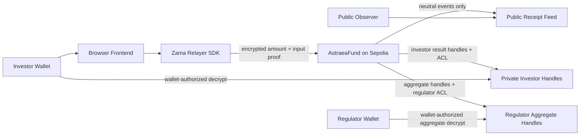

# Astraea — The Blind Regulator

Audit without surveillance.

Astraea lets tokenized fund issuers prove subscription compliance onchain without exposing investor amounts or outcomes.

## Problem

Public chains are useful for audit trails, but regulated finance cannot publish investor books. A subscription workflow needs receipts, timestamps, and proof that policy checks ran, while investor amounts, individual outcomes, reason codes, and aggregate books remain private.

## Solution

Astraea is a Zama FHEVM confidential RWA subscription policy engine. Investors submit encrypted subscription amounts. `AstraeaFund` evaluates both subscription rules while values remain encrypted:

- encrypted amount <= `maxInvestorSubscription`
- encrypted accepted exposure + encrypted amount <= `maxFundExposure`

The contract stores encrypted investor results, updates encrypted regulator aggregates, and emits neutral public receipts with no private facts.

## Why FHEVM Matters

Plain smart contracts must reveal data to compute on it. FHEVM lets Astraea compute policy checks directly over encrypted values, so the public chain proves process integrity without becoming a surveillance surface.

## Public vs Private

Public:

- fund name, policy version, public caps, unit label,
- lifecycle state,
- neutral receipt events,
- transaction hashes and timestamps.

Private:

- investor subscription amounts,
- approval/rejection,
- reason codes,
- aggregate accepted exposure and counts,
- wallet-authorized decrypt results.

## Sepolia Deployment

- `AstraeaFund`: `0xB9F38E0180F62e80Be6ca44cE6202316FCcefEC9`
- Deployment block: `10828295`
- Deploy tx: `0xcf2f17f4078c0d3b16a556c9e7b22173a1deef1cf0a9906a161bbbeb94c8a323`
- Open tx: `0xad6c39e3a2f1ec1ef0d4eaba8c6aea30687f8371b6f04006918c42446eb9a700`
- Investor A seed tx: `0xf2ed8d0897adb552e8f7dd4928e87c935ba553b19e318b6530cbcd37536beb26`
- Investor B seed tx: `0x6caad0479f925cab61559a45528d23768ae125be42e3f1ff59fd622fab88ec4d`
- Investor C seed tx: `0x5ea8434ceee4574585a484de8ee0d7f27a30f08d6333ee84f6308a3f900b3b66`

## Actor Roles

- Issuer/deployer: `0x94c188F8280cA706949CC030F69e42B5544514ac`
- Investor A: `0xb4D1e1B488636EaF0e074ACF1B6b5C4F6Af223e6`
- Investor B: `0xB1C45B18639f736Cdc5F22D2C75EB4f0474e3d7B`
- Investor C: `0xc99033b39a2a4e375452e088C42EeAD320e9Acd6`
- Regulator: `0xB6767dAA4aF50DA070FE2600E5f9C0d8146227fe`

Private keys are local-only in ignored files such as `contracts/sepolia-actors.local.json` and `contracts/.env`. Never paste keys into chat, docs, commits, screenshots, or issue trackers.

## Demo Policy

- Fund: Astraea APAC Growth Note I
- Policy version: v1
- Max investor subscription: `500000`
- Max fund exposure: `700000`
- Unit: USDC simplified units

Verified Sepolia results:

- Investor A: `400000` -> approved `true`, reason `1`
- Investor B: `600000` -> approved `false`, reason `2`
- Investor C: `400000` -> approved `false`, reason `3`
- Regulator aggregate: accepted exposure `400000`, accepted count `1`, rejected count `2`

These values are for the authorized investor/regulator views and documentation. The Public Observer UI must not reveal them.

## Architecture



## Install And Verify

```bash
cd contracts
npm install
npm run compile
npm test
npm run typecheck
npm run export:frontend

cd ../sdk
npm install
npm run typecheck

cd ../frontend
npm install
npm run typecheck
npm run build
```

## Frontend

```bash
cp frontend/.env.example frontend/.env
cp frontend-handoff/ABI.json frontend/public/ABI.json
cd frontend
npm run dev
```

Product-mode defaults:

```bash
VITE_CHAIN_ID=11155111
VITE_ASTRAEA_FUND_ADDRESS=0xB9F38E0180F62e80Be6ca44cE6202316FCcefEC9
VITE_ZAMA_RELAYER_URL=https://relayer.testnet.zama.org
VITE_SHOW_INTERNAL_GUIDES=false
VITE_ENABLE_DEMO_ASSIST=false
VITE_ENABLE_ISSUER_CONTROLS=false
```

Set `VITE_SEPOLIA_RPC_URL` locally or in Netlify environment for read-only public event loading. Do not commit provider URLs with private API keys.

Internal recording aids are opt-in only:

```bash
VITE_SHOW_INTERNAL_GUIDES=true
```

## Repo Map

- `contracts/`: Hardhat FHEVM contracts, tests, deployment scripts, actor tooling.
- `frontend/`: Vite React product UI.
- `sdk/`: TypeScript client helpers.
- `frontend-handoff/`: ABI, deployment address files, component specs, user flows.
- `docs/`: architecture, privacy model, Sepolia runbook, engineering status.
- `bounty-skill/`: reusable Astraea Confidential Finance Patterns artifact.

## Related Bounty Artifact: Astraea Confidential Finance Patterns

The bounty skill lives at `bounty-skill/SKILL.md`. It packages the reusable FHEVM patterns behind Astraea: encrypted inputs, encrypted comparison, `FHE.select`, conditional encrypted accumulators, ACL-gated decrypts, and no-leak public receipts.

It is derived from the working Sepolia dApp and is useful for other Zama builders designing confidential finance, private eligibility, voting, or regulator aggregate flows.

Validate it with:

```bash
cd bounty-skill
npm run validate
```

## Screenshots

Screenshots are intentionally not committed in this engineering pass. Capture final screenshots from the Netlify deployment for submission materials.

## Limitations And Non-Goals

Sepolia testnet demonstration only. No real assets, no real KYC, no token movement, no marketplace, no oracle integration, and not a licensed compliance product.

Mock FHEVM tests prove local contract behavior. Sepolia rehearsal proves relayer encryption/decryption and ACL-gated wallet flows.

## Current Test Status

- Contracts: compile, test, typecheck pass.
- SDK: typecheck passes.
- Frontend: typecheck and production build pass.
- Bounty skill: validation passes.

## Credential Hygiene

Never commit `.env`, actor key files, private provider URLs, wallet private keys, recovery phrases, Netlify local state, `node_modules`, `dist`, Hardhat `artifacts`, or Hardhat `cache`.
