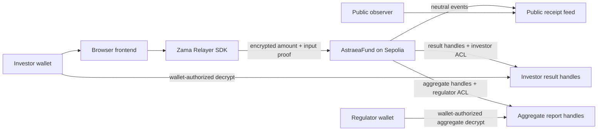

# Astraea — The Blind Regulator

**Confidential subscription-policy evaluation for tokenized funds, built with Zama FHEVM.**

[Live demo](https://astraea-blind-regulator.netlify.app) · [Sepolia contract](https://sepolia.etherscan.io/address/0xB9F38E0180F62e80Be6ca44cE6202316FCcefEC9) · [Skill artifact](./bounty-skill/SKILL.md)

Astraea lets tokenized fund issuers prove that subscription rules were evaluated onchain without exposing investor amounts, approval outcomes, reason codes, or aggregate books.

## Why Astraea

Public blockchains are strong audit trails and weak privacy surfaces. A tokenized fund can publish lifecycle receipts, timestamps, and policy metadata, but it should not expose each investor's subscription amount or whether a specific wallet passed a private eligibility rule.

Astraea demonstrates the missing middle: public compliance receipts with private investor facts.

## What It Does

- The issuer publishes one public fund policy.
- Investors submit encrypted subscription amounts through the Zama relayer flow.
- `AstraeaFund` evaluates policy constraints over encrypted values.
- Public observers see neutral receipt events, never outcomes.
- Each investor decrypts only their own encrypted result.
- The regulator decrypts only aggregate compliance metrics.

## Why Zama FHEVM

This is not ordinary offchain encryption. Zama FHEVM lets the smart contract compute over encrypted values:

- private amounts remain encrypted during policy evaluation,
- encrypted comparisons and `FHE.select` drive onchain state updates,
- ACL grants scope who can decrypt which handles,
- public events prove process without leaking private state.

## Architecture



## Privacy Model

| Actor | Can see | Cannot see |
| --- | --- | --- |
| Public observer | Fund metadata, lifecycle events, receipt timestamps, transaction hashes | Investor amounts, approval outcomes, reason codes, aggregate report |
| Issuer | Public policy, lifecycle state, public receipts | Individual decrypted investor results in the demo |
| Investor | Own decrypted approval result and reason code after wallet authorization | Other investors' results, regulator aggregate report |
| Regulator | Decrypted aggregate accepted exposure/counts after wallet authorization | Individual investor amounts or individual result handles |

## Smart Contract Policy

The deployed policy checks both constraints privately:

```text
amount <= maxInvestorSubscription
acceptedExposure + amount <= maxFundExposure
```

The demo policy is:

| Field | Value |
| --- | --- |
| Fund | Astraea APAC Growth Note I |
| Policy version | v1 |
| Max investor subscription | 500000 |
| Max fund exposure | 700000 |
| Unit | USDC simplified units |

Verified Sepolia rehearsal:

| Actor | Private input | Private result |
| --- | ---: | --- |
| Investor A | 400000 | approved, reason 1 |
| Investor B | 600000 | rejected by per-investor cap, reason 2 |
| Investor C | 400000 | rejected by fund capacity, reason 3 |
| Regulator aggregate | - | accepted exposure 400000, accepted count 1, rejected count 2 |

These values are shown in documentation for reproducibility. The product UI keeps them out of public observer views.

## Live Deployment

| Item | Value |
| --- | --- |
| Frontend | https://astraea-blind-regulator.netlify.app |
| Network | Sepolia, chain id `11155111` |
| Contract | [`0xB9F38E0180F62e80Be6ca44cE6202316FCcefEC9`](https://sepolia.etherscan.io/address/0xB9F38E0180F62e80Be6ca44cE6202316FCcefEC9) |
| Deployment block | `10828295` |
| Deploy tx | [`0xcf2f17f4078c0d3b16a556c9e7b22173a1deef1cf0a9906a161bbbeb94c8a323`](https://sepolia.etherscan.io/tx/0xcf2f17f4078c0d3b16a556c9e7b22173a1deef1cf0a9906a161bbbeb94c8a323) |
| Open tx | [`0xad6c39e3a2f1ec1ef0d4eaba8c6aea30687f8371b6f04006918c42446eb9a700`](https://sepolia.etherscan.io/tx/0xad6c39e3a2f1ec1ef0d4eaba8c6aea30687f8371b6f04006918c42446eb9a700) |
| Investor A submit tx | [`0xf2ed8d0897adb552e8f7dd4928e87c935ba553b19e318b6530cbcd37536beb26`](https://sepolia.etherscan.io/tx/0xf2ed8d0897adb552e8f7dd4928e87c935ba553b19e318b6530cbcd37536beb26) |
| Investor B submit tx | [`0x6caad0479f925cab61559a45528d23768ae125be42e3f1ff59fd622fab88ec4d`](https://sepolia.etherscan.io/tx/0x6caad0479f925cab61559a45528d23768ae125be42e3f1ff59fd622fab88ec4d) |
| Investor C submit tx | [`0x5ea8434ceee4574585a484de8ee0d7f27a30f08d6333ee84f6308a3f900b3b66`](https://sepolia.etherscan.io/tx/0x5ea8434ceee4574585a484de8ee0d7f27a30f08d6333ee84f6308a3f900b3b66) |
| Zama relayer | `https://relayer.testnet.zama.org` |

Sepolia testnet demonstration only. No real assets, no real KYC, no token movement, and not a licensed compliance product.

## Repository Layout

| Path | Purpose |
| --- | --- |
| `contracts/` | Hardhat contracts, tests, deployment, seeding, Sepolia verification scripts |
| `frontend/` | React/Vite product UI for Sepolia and local rehearsals |
| `sdk/` | TypeScript client helpers for contract reads, encrypted submissions, and decrypt adapters |
| `bounty-skill/` | Reusable FHEVM AI-agent skill and validation artifact |
| `docs/` | Public architecture, privacy, Sepolia, and API decision notes |

## Run Locally

Contracts:

```bash
cd contracts
npm install
npm run compile
npm test
npm run typecheck
npm run export:frontend
```

SDK:

```bash
cd sdk
npm install
npm run typecheck
```

Frontend:

```bash
cd frontend
npm install
cp .env.example .env
npm run dev
```

Recommended product-mode frontend env:

```bash
VITE_CHAIN_ID=11155111
VITE_ASTRAEA_FUND_ADDRESS=0xB9F38E0180F62e80Be6ca44cE6202316FCcefEC9
VITE_SEPOLIA_RPC_URL=
VITE_ZAMA_RELAYER_URL=https://relayer.testnet.zama.org
VITE_ENABLE_DEMO_ASSIST=false
VITE_SHOW_INTERNAL_GUIDES=false
VITE_ENABLE_ISSUER_CONTROLS=false
```

Set `VITE_SEPOLIA_RPC_URL` locally or in Netlify for public event loading. Do not commit private provider URLs.

## Verification

```bash
cd contracts
npm run compile
npm test
npm run typecheck
npm run export:frontend

cd ../sdk
npm run typecheck

cd ../frontend
npm run typecheck
npm run build

cd ../bounty-skill
npm run validate
```

## Bounty Skill

[`bounty-skill/SKILL.md`](./bounty-skill/SKILL.md) packages the reusable engineering patterns behind Astraea for AI coding agents and Zama builders:

- encrypted input and proof handling,
- encrypted comparisons and `FHE.select`,
- conditional encrypted state updates,
- ACL-scoped user and regulator decrypt flows,
- no-leak public receipt design,
- frontend product/demo mode separation,
- tests and anti-patterns for privacy regressions.

The artifact is derived from the working Sepolia dApp but is intentionally reusable for confidential finance, private eligibility, sealed voting, and aggregate reporting demos.

## Roadmap

- Complete hardened browser FHE encryption/decryption rehearsals across major wallet/browser combinations.
- Add richer regulator reporting across multiple policy windows while preserving investor privacy.
- Add automated frontend wallet-state and relayer-failure integration tests.
- Expand the skill artifact with confidential voting and ERC-7984-oriented templates.
- Explore production-grade issuer onboarding and policy configuration.
- Improve public receipt analytics without exposing private outcomes.

## License

MIT. Sepolia testnet demonstration only: no real assets, no real KYC, no token movement, no marketplace, and not a licensed compliance product.
